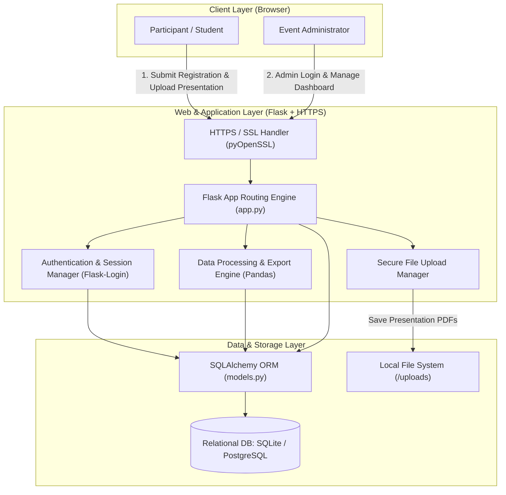
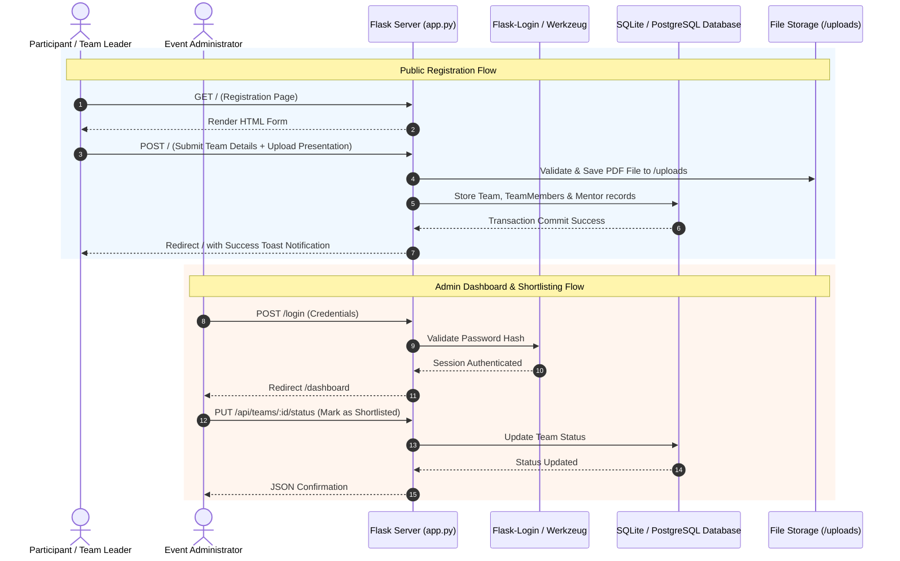
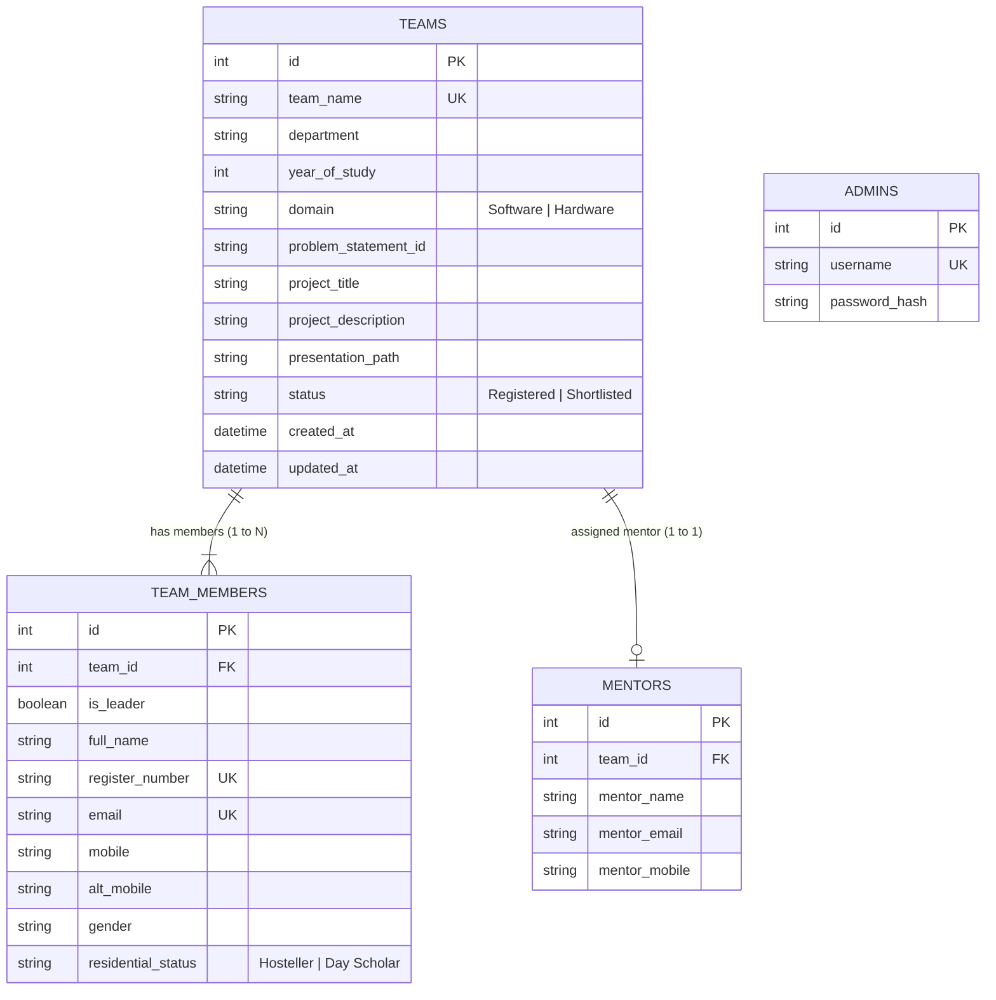

# 🚀 Hackathon Registration System

A full-stack, secure web application for managing Hackathon team registrations, mentor assignments, project proposal submissions (PPT/PDF), and administrative evaluation workflows.

---

## 🏛️ System Architecture Diagram



---

## 🔄 Component Interaction Flow



---

## 🗄️ Database Entity-Relationship (ER) Diagram



---

## ✨ Core Features

- **Dynamic Registration Form**: Supports multi-member teams, leader designations, mentor details, and project proposals.
- **Secure Presentation Uploads**: Handles PDF/PPT project presentation uploads with filename sanitization and size limits (max 20MB).
- **Admin Dashboard**: Real-time evaluation portal with search filters, domain filtering (Software/Hardware), and status toggling (Shortlist / Reinstate).
- **Public Shortlist View**: Dedicated page displaying officially shortlisted teams for public announcement.
- **Data Exporting**: Export all team registrations into Excel (`.xlsx`) or CSV format using Pandas.
- **SSL / HTTPS Support**: Configured for local development and deployment with custom SSL certificates (`cert.pem`, `key.pem`).

---

## 🛠️ Technology Stack

| Layer | Technology |
| :--- | :--- |
| **Backend Framework** | Python 3.14, Flask 3.1+ |
| **Authentication & Security** | Flask-Login, Werkzeug Security, PyOpenSSL |
| **Database & ORM** | Flask-SQLAlchemy, SQLAlchemy 2.0+, SQLite / PostgreSQL |
| **Data Processing** | Pandas, OpenPyXL |
| **Frontend** | HTML5, Vanilla CSS3, JavaScript (ES6+ AJAX) |

---

## 📂 Project Structure

```text
Registration/
├── app.py              # Main Flask application, routes, and API endpoints
├── models.py           # SQLAlchemy database models (Team, TeamMember, Mentor, Admin)
├── db_init.py          # Database initialization & seeding script
├── requirements.txt    # Python package dependencies
├── cert.pem / key.pem  # SSL/TLS certificates for HTTPS
├── static/
│   ├── css/            # UI styles
│   └── js/             # Interactive client-side scripts
├── templates/
│   ├── base.html       # Base Jinja2 layout
│   ├── index.html      # Public registration form
│   ├── login.html      # Admin login page
│   ├── dashboard.html  # Admin management portal
│   └── shortlisted.html# Public shortlisted teams showcase
└── uploads/            # Storage folder for uploaded presentation files
```

---

## ⚡ Quick Start Guide

### 1. Prerequisites
- Python 3.10+ installed on your system.

### 2. Environment Setup

```bash
# Clone or navigate to project workspace
cd /Volumes/ExtremeSSD/Registration

# Create virtual environment
python3 -m venv venv

# Activate virtual environment
source venv/bin/activate

# Install dependencies
pip install -r requirements.txt
```

### 3. Database Initialization

```bash
python db_init.py
```
> **Default Admin Credentials**:
> - **Username**: `admin`
> - **Password**: `admin123`

### 4. Running the Server

```bash
python app.py
```
Access the application at:
- **HTTP**: `http://127.0.0.1:5000`
- **HTTPS**: `https://127.0.0.1:5000` (if SSL certs are configured)
